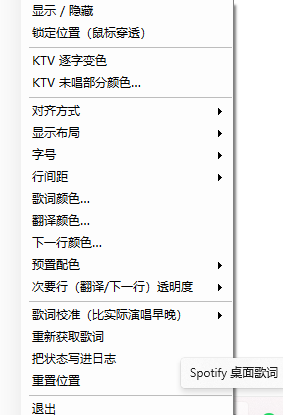

# Spotify 桌面悬浮歌词

> A floating desktop lyrics overlay for the Spotify desktop client on Windows.
> Synced lyrics + Chinese translation, KTV-style progressive highlight, fully customizable
> colours / sizes / alignment, click-through when locked. No Premium, no API key required.

Windows 上的 **Spotify 桌面歌词悬浮层**。三行显示（原文 / 中文翻译 / 下一句）、KTV 逐字变色、颜色字号对齐全可调、可鼠标穿透。

**不需要 Spotify Premium，不需要 API key，不需要改动 Spotify 客户端本体。**

---

## 截图

**歌词本体** —— 粉色是已唱部分、灰色是还没唱到的部分（KTV 逐字推进），下面那行是自动配的中文翻译：


**右键菜单** —— 所有设置都在这里，托盘图标右键是同一套；日常锁定后完全鼠标穿透，不挡任何点击：



---

## 功能

- **三行显示**：当前句（大字）/ 中文翻译 / 下一句。中间那行永不空着——这句没翻译时，下一句自动顶上来
- **KTV 逐字变色**：当前句按播放进度从左到右渐变，颜色与"未唱部分"颜色都可调
- **自动中文翻译**：外文歌自动带逐行中文翻译，与原文按时间戳配对；中文歌不会显示多余的"翻译"
- **歌词缓存**：听过的歌下次直接命中缓存，**75 毫秒**出歌词（首次约 1~3 秒）
- **完全可调**：字号（主歌词/翻译/下一句分别调，也可按比例跟随）、颜色（取色器 + 5 套预置配色 + 透明度）、行间距、对齐方式（居中/左对齐/右对齐）、显示布局
- **歌词校准**：LRC 时间戳常比实际演唱晚 0.2~0.5 秒，可用菜单整体提前/延后，对齐到"唱到哪亮到哪"
- **两种鼠标状态**
  - **未锁定**：左键拖动移动、右键出菜单、鼠标悬停右下角手柄可拖拽改字号
  - **锁定**：完全鼠标穿透，不挡任何点击（日常用这个）
- **无窗口启动**：`start-lyrics.vbs` 静默后台运行，托盘图标控制
- 不干扰 Spotify：只**读取**系统媒体会话，不改客户端、不注入、不需要登录

## 环境要求

| 项目 | 要求 |
|---|---|
| 系统 | Windows 10 / 11 |
| PowerShell | Windows PowerShell 5.1（系统自带） |
| Node.js | 18 或更高（用于抓取歌词） |

> 用 `node -v` 可以检查；没有的话去 https://nodejs.org 装一个 LTS 版即可。

## 快速开始

1. 把整个文件夹放到任意位置（路径里最好别有奇怪符号）
2. **双击 `run-lyrics-overlay.cmd`** —— 带控制台窗口，方便看到报错
3. 用 Spotify 放一首歌 → 屏幕底部中央出现歌词
4. 确认正常后，日常改用 **`start-lyrics.vbs`**（无控制台窗口，后台运行）
5. 退出：托盘图标右键 → 退出（也可右键歌词本体）

> 想开机自启：把 `start-lyrics.vbs` 的快捷方式丢进
> `%APPDATA%\Microsoft\Windows\Start Menu\Programs\Startup`

## 操作方式

| 操作 | 效果 |
|---|---|
| **左键拖动歌词** | 移动位置（未锁定时） |
| **右键歌词** | 弹出完整菜单 |
| **鼠标悬停歌词** | 浮现右下角小方块手柄 + 淡白边框 |
| **拖右下角手柄** | 实时改字号（拖 20 像素 = 1 号字）——**三行一起缩放**，比例保持不变 |
| **托盘图标右键** | 同一套菜单 |

## 菜单说明

| 菜单项 | 说明 |
|---|---|
| 显示歌词 | 整个悬浮层的显示开关（**带勾选状态**） |
| 锁定位置（鼠标穿透） | 在"可拖动"和"完全穿透"之间切换（**带勾选状态**） |
| KTV 逐字变色 | KTV 效果开关（**带勾选状态**） |
| KTV 未唱部分颜色… | 未唱到的文字颜色（默认半透明白） |
| 对齐方式 | 居中 / 左对齐 / 右对齐（**真正的锚点对齐**，文字长短变化时不会左右抖动） |
| 显示布局 | 原文+翻译+下一句 / 原文+翻译 / 原文+下一句 / 仅原文 |
| 字号 | **只有一套机制**：主歌词是唯一主控，翻译/下一句按比例跟着它走。增减小歌词改绝对值，增减翻译/下一句改比例（每次 3%）。所以拖右下角手柄时三行永远一起缩放。另有"重置比例（66% / 56%）" |
| 行间距 | 紧凑 / 标准 / 宽松 / 很宽 |
| 歌词颜色… / 翻译颜色… / 下一行颜色… | 打开系统取色器（**保留原有透明度**） |
| 预置配色 | 纯白 / 暖金 / 天蓝 / 樱花粉 / 薄荷绿（一键三色 + KTV 底色） |
| 次要行透明度 | 翻译与下一句一起调：100% ~ 25% |
| 歌词校准 | 提前 / 延后 0.2 秒、重置 |
| 重新获取歌词（忽略缓存） | 抓错了或数据源更新后用。**会真正绕开本地缓存重新去查** |
| 把状态写进日志 | 把当前歌词来源、字号、校准值写进 `lyrics-overlay.log` |
| 重置位置 | 回到屏幕底部中央 |

## 配置文件

`lyrics-overlay.json` 会保存在脚本同目录，所有设置自动持久化（首次运行自动生成，删掉即恢复默认）。
想手动改的话，可以直接把 `lyrics-overlay.example.json` 复制成 `lyrics-overlay.json` 再编辑——**改之前先退出程序**，否则退出时会被内存里的设置覆盖。

| 键 | 默认 | 说明 |
|---|---|---|
| `AnchorX` / `Top` | -1 | 锚点坐标；-1 = 首次自动放屏幕底部中央 |
| `Anchor` | `center` | `center` / `left` / `right` |
| `FontSize` | 30 | 主歌词字号（**唯一的主控**） |
| `TransRatio` / `NextRatio` | 0.66 / 0.56 | 翻译 / 下一句相对主歌词的比例（范围 0.25 ~ 1.60） |
| `TransFontSize` / `NextFontSize` | 20 / 17 | **只读**：每次按比例算出来的实际字号，手动改无效 |
| `FollowMain` | true | **已废弃**：比例机制已成唯一路径，这行只是为了兼容旧配置 |
| `ShowTrans` / `ShowNextLine` | true | 是否显示翻译 / 下一句 |
| `MaxWidth` | 1200 | 单行最大宽度（超出换行） |
| `TextColor` / `TransColor` / `NextColor` | 白 / 暖金 85% / 暖金 45% | `#AARRGGBB` |
| `Karaoke` | true | KTV 逐字变色 |
| `KaraokeBaseColor` | `#59FFFFFF` | 未唱部分颜色 |
| `LyricsOffset` | 0.0 | 歌词校准（秒，正值 = 提前） |
| `Shadow` | true | 文字投影（任何壁纸上都看得清） |
| `Locked` | false | 锁定（鼠标穿透） |
| `GapScale` | 1.0 | 行间距倍率 |
| `PollMs` | 500 | 查询 SMTC 的间隔（画面更新不受它限制） |

## 工作原理

```
Windows SMTC ─────────────► 曲目 / 歌手 / 专辑 / 播放进度 / 播放状态
(Windows.Media.Control)       （免账号、免 API key、免 Premium）

LRCLIB  ──► 原文（时间轴通常更准）
网易云   ──► 逐行中文翻译（tlyric）      ──► 两轮时间戳配对 ──► 本地缓存
                                            严格 ±0.8s → 单调顺序 ±3.5s

WPF 无边框 + 逐像素透明 + 置顶
 + WS_EX_TRANSPARENT（锁定后鼠标穿透）
 + WS_EX_TOOLWINDOW（不进任务栏/Alt-Tab）

画面刷新：CompositionTarget.Rendering（每帧回调，与 VSync 对齐，~60fps）
播放位置：Stopwatch 逐帧累加 + 每次轮询平滑吸收 SMTC 误差（25%），
          只有超过 2.5 秒的真跳转（拖进度条）才硬对齐
KTV 填充：双层 TextBlock，上层用 RectangleGeometry 裁剪出已唱部分
```

## 已知限制

- **翻译覆盖不完整**：网易云只翻译了部分行（重复段落常不翻译），所以有的句子有翻译、有的没有——这是数据源本身的特性，不是 bug
- **中文歌通常没有翻译**：网易云对中文歌返回的"翻译"与原文相同，会被自动过滤掉
- **网易云没有的歌会退回 LRCLIB**：对已下架 / 没版权的曲目（例如罗大佑的部分作品），网易云不会返回空，而是返回该歌手**别的热门歌**。程序对此有一道硬门槛——**标题不像就整条否决**，宁可这首没有翻译，也不会拿别的歌的歌词来凑。这类歌通常只有原文、没有翻译
- **两个数据源都可能限流，已做多重兜底**：LRCLIB 高峰期会回 503（自动退避重试 + 五种查询策略依次尝试）；网易云的搜索接口被限流时会返回 **HTTP 200 + `code:405 操作频繁`**（会识别并切换到备用接口，而不是当成"没这首歌"）。两边都拿不到时才会显示"未找到歌词"
- **网易云接口是非官方的**，可能限流；已做本地缓存（有翻译缓存 60 天、无翻译只缓存 6 小时以便稍后重试）和失败重试
- **KTV 不是真·逐字**：LRC 只有行级时间戳，所以填充是"按行时长线性推进"，不是每个字有自己的时间点。想要真·逐字需要接入网易云的 `yrc` 逐字歌词接口
- **超长句换行时**，KTV 填充是一道垂直切面跨过两行（不是逐行推进）
- 只支持 **Spotify 桌面客户端**（依赖它向 Windows 媒体会话暴露信息）；网页版不支持

## 免责声明

- 本项目仅用于**学习与个人使用**
- 歌词内容来自 [LRCLIB](https://lrclib.net) 与网易云音乐，**版权归各服务商与原权利人所有**，本项目不存储、不再分发歌词内容
- 使用的第三方接口均为公开接口，**非官方、可能随时变更**；请自行遵守相应服务的使用条款
- 使用本工具产生的任何后果由使用者自行承担

## 许可

[MIT](LICENSE)
